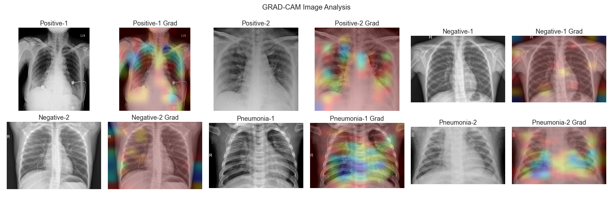
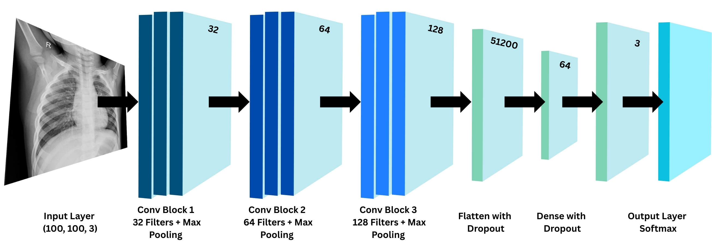
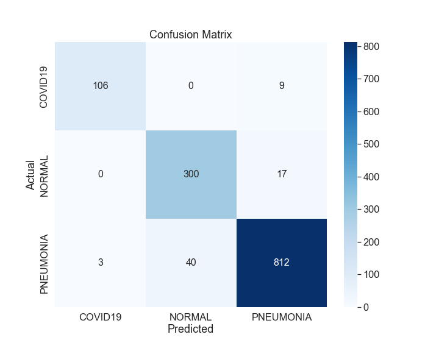
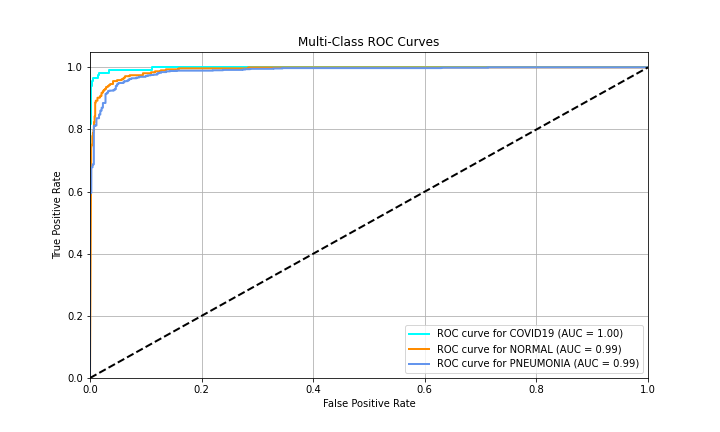
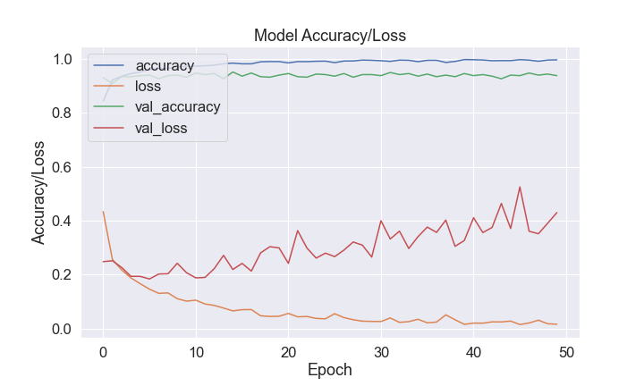

<div align="center">
  
  <h1>COVID-19 Classification from Chest X-Ray Images</h1>
</div>


A deep learning-based system using Convolutional Neural Networks (CNN) to automatically classify chest X-ray images into **COVID-19**, **Pneumonia**, or **Normal** categories. Designed as a rapid, accessible, and scalable diagnostic aid for clinical settings.

## Table of Contents

1.  [Abstract](#abstract)
2.  [Project Description](#project-description)
    - [Key Components](#key-components)
    - [Model Architecture](#model-architecture)
    - [Grad-CAM Visualisation](#grad-cam-visualisation)
3.  [Project Structure](#project-structure)
4.  [Installation](#installation)
    - [Prerequisites](#prerequisites)
    - [Steps for Installation](#steps-for-installation)
    - [Installation Notes](#installation-notes)
5.  [User Interface](#user-interface)
6.  [Methodology and Model Overview](#methodology-and-model-overview)
7.  [Results](#results)
    - [Key Metrics](#key-metrics)
8.  [Dataset](#dataset)
9.  [Project Poster](#project-poster)
10.  [Future Work](#future-work)
11. [Contributing](#contributing)
12. [License](#license)
13. [Contact](#contact)
14. [Credits](#credits)

## Abstract

The COVID-19 pandemic highlighted the urgent need for rapid and accurate diagnostic tools. While RT-PCR remains the standard, its accessibility and turnaround time are limited in some regions. This project leverages **Convolutional Neural Networks (CNN)** to perform multi-class classification of chest X-ray images, distinguishing between COVID-19, Pneumonia, and Normal lungs with high accuracy.

Our trained model achieved **AUC = ~0.99** on the test set, showing strong potential for deployment in mass screening scenarios.


## Project Description

### Key Components:

- **Data Preprocessing**: Resizing all images to 100×100 pixels, normalisation, and augmentation (rotations, flips, shifts) to improve generalisation.
- **CNN Model**: A 3-layer convolutional architecture with ReLU activation, dropout, and L2 regularisation for robustness.
- **Evaluation**: Accuracy, precision, recall, F1-score, confusion matrices, and ROC curves.
- **Interpretability**: Grad-CAM heatmaps to highlight image regions influencing the model’s decision.
- **Deployment**: Interactive web interface using **Streamlit** for real-time classification.


### Model Architecture

- **Input Layer**: `(100, 100, 3)` chest X-ray images
- **Feature Extraction**: 3 convolutional layers with ReLU activation + max pooling
- **Regularisation**: Dropout and L2 regularisation to prevent overfitting
- **Output Layer**: Softmax activation for 3-class classification

### Grad-CAM Visualisation

Grad-CAM overlays are generated to visualise regions in X-rays most influential in classification, improving model transparency for clinical adoption.




## Project Structure

```plaintext
ChestXRayClassifier/
├── Data/                     # Dataset (X-ray images)
├── images/                   # Folder for Grad-CAM outputs and other images
│   ├── gradcam_outputs/      # Grad-CAM visualizations
│   ├── confusionmatrix       # Confusion matrix and related images
│   ├── accuracy_loss         # Accuracy and loss plots
│   ├── augmentation          # Augmentation-related images
│   ├── roc_curves            # ROC curve plots
│   ├── logo                  # Project logo and branding
│   ├── count                 # Count Plot
├── model/                    # Folder for model saving and loading
│   ├── xray_cnn_model.keras  # Trained model file
├── notebook/                 # Jupyter notebook for experimentation
│   ├── ChestXRayClassifier   # .ipynb file
├── poster/                   # Project poster
│   ├── Poster                # Poster .pdf
├── Literature review/        # Research and reference material
├── ├── Literature_review.pdf # Literature review document
├── app.py                    # Streamlit application for real-time predictions
├── requirements.txt          # Dependencies and package versions
├── README.md                 # Project documentation
```


## Installation

The installation process involves setting up a Python environment and installing the required dependencies. The instructions below provide steps for macOS, Windows, and Linux systems.

### Prerequisites

Ensure you have the following installed:

- Python 3.10+
- pip (Python package installer)
- git


### Steps for Installation

1. **Clone the repository:**

   ```sh
   git clone https://github.com/Akash29nair/project-maths-modelling-project.git
   cd project-maths-modelling-project
   ```

2. **Create a virtual environment:**

   ```sh
   python -m venv venv
   ```

   - **On macOS/Linux:**
     ```sh
     source venv/bin/activate
     ```
   - **On Windows:**
     ```sh
     venv\Scripts\activate
     ```

3. **Install the dependencies:**
   ```sh
   pip install -r requirements.txt
   ```

### Installation Notes

- **macOS/Linux:** Ensure that you have the necessary permissions and use the `source` command to activate the virtual environment. For some Linux distributions, you may need to install additional libraries (e.g., `sudo apt-get install python3-venv`).
- **Windows:** Make sure to use the correct path to activate the virtual environment. You may need to enable script execution by running `Set-ExecutionPolicy RemoteSigned -Scope Process` in PowerShell.


## User Interface

**Run the Streamlit app for real-time classification:**

   ```sh
   streamlit run src/app.py
   ```

### UI Screenshot

<div style="display: flex; justify-content: space-between;">
  
  
</div>

   
- **Upload a chest X-ray image**

- **Get predicted class and confidence scores**


## Methodology and Model Overview

This project employs a **Convolutional Neural Network (CNN)** to classify chest X-ray images into three categories: **COVID-19**, **Pneumonia**, and **Normal**. The model architecture consists of **3 convolutional layers**, each followed by **max-pooling** and **ReLU activation**. The network is trained using the **Adam optimizer** and uses **softmax activation** in the output layer for multi-class classification.



### Model Evaluation:

The model’s performance is evaluated using several metrics:

- **Accuracy**: Measures the percentage of correctly predicted instances.
- **Precision**: Indicates how many of the positive predictions were actually correct.
- **Recall**: Measures how many of the actual positive cases were identified correctly.
- **F1-Score**: The harmonic mean of precision and recall, balancing both.
- **Support**: The number of actual occurrences of each class in the dataset.

The model achieved an **AUC = ~0.99**, with high values for **F1-score**, **precision**, and **recall**, demonstrating its strong ability to differentiate between **COVID-19**, **Pneumonia**, and **Normal** chest X-ray images.


## Results

The model demonstrates high performance and robust
generalization on the independent test set. The key evaluation
metrics are presented below.

### Key Metrics

### Classification Report: Validation Set

| Metric      | Precision | Recall  | F1-Score | Support |
|-------------|-----------|---------|----------|---------|
| **COVID-19**| 1         | 0.92    | 0.95833  | 50      |
| **Normal**  | 0.82836   | 0.91736 | 0.87059  | 121     |
| **Pneumonia**| 0.96418   | 0.93895 | 0.9514   | 344     |
| **Accuracy**|           |         | 0.93204  | 515     |
| **Macro Avg**| 0.93085  | 0.92544 | 0.92677  | 515     |
| **Weight Avg**| 0.93575 | 0.93204 | 0.93309  | 515     |


### Classification Report: Test Set

| Metric      | Precision | Recall  | F1-Score | Support |
|-------------|-----------|---------|----------|---------|
| **COVID-19**| 0.99029   | 0.88696 | 0.93578  | 115     |
| **Normal**  | 0.91049   | 0.9306  | 0.92044  | 317     |
| **Pneumonia**| 0.96395   | 0.96959 | 0.96676  | 855     |
| **Accuracy**|           |         | 0.9526   | 1287    |
| **Macro Avg**| 0.95491  | 0.92905 | 0.94099  | 1287    |
| **Weight Avg**| 0.95314 | 0.9526  | 0.95258  | 1287    |


### Confusion Matrix

This 3x3 matrix visualizes the model's performance, showing the counts of **True Positives**, **True Negatives**, **False Positives**, and **False Negatives** across all classes.




### Multi-Class ROC Curves

These curves illustrate our model's diagnostic ability across all classes, demonstrating excellent performance with **AUC** scores of **0.99** or higher.




### Model Accuracy/Loss

This plot illustrates the model's training progression over epochs, showing both **accuracy** and **loss** for the training and validation sets.




### Discussion

Our deep learning model demonstrates robust diagnostic capabilities for accurately differentiating **COVID-19**, **Normal**, and **Pneumonia** cases from chest X-rays. The **classification report** and **confusion matrix** highlight high precision, recall, and F1-scores across all classes, indicating a low misdiagnosis rate for critical conditions crucial for timely clinical intervention. The multi-class **ROC AUC curves**, consistently near 1.0, further affirm the model's exceptional diagnostic ability across these distinct pathologies. Furthermore, the **accuracy** and **loss curves** illustrate stable training and strong generalization to the validation set, suggesting the model's stability and readiness for new, unseen data.

## Dataset

The dataset used in this project is publicly available on Kaggle. You can download it from the following link:

[Chest X-ray Image Dataset by Alsaniipe](https://www.kaggle.com/datasets/alsaniipe/chest-x-ray-image)

### Directory Structure for Dataset

Once you've downloaded and extracted the dataset, make sure your directory structure looks like this:

```plaintext
Data/
├── train/
│   ├── COVID19/
│   ├── NORMAL/
│   └── PNEUMONIA/
├── test/
│   ├── COVID19/
│   ├── NORMAL/
│   └── PNEUMONIA/
```

## Project Poster

For a detailed visual overview of the project, you can view the project poster, which summarises the methodology, results, and future scope.

[**Download the Poster (PDF)**](poster/Poster.pdf)


## Future Work

* Expand dataset size and diversity for improved robustness
* Explore transfer learning with larger pretrained networks
* Integrate uncertainty estimation for clinical decision support


## Contributing

Contributions are welcome, feel free to fork the repo and submit pull requests.


## License

This project is licensed under the MIT License.


## Contact

For any queries, Contact:  
**Akash Nair** – [akash.nair@ucdconnect.ie](mailto:akash.nair@ucdconnect.ie)  
**Jagruti Patil** – [jagruti.patil@ucdconnect.ie](mailto:jagruti.patil@ucdconnect.ie)

## Credits

This project is in collaboration with [Jagruti Patil](https://github.com/JagrutiPatil09)
